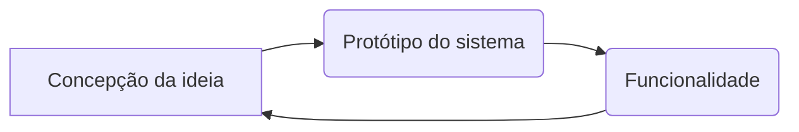
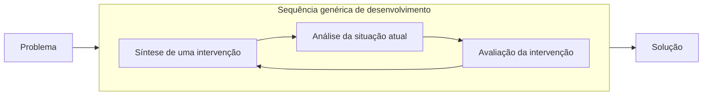

A especificação do processo de interação do usuário com o sistema é papel do desenvolvedor ou, mas especificamente do UI (User Interface Design) responsável pelo design da interface.

### As etapas:
1. Análise:
> Conhecimento macro do problema, dos atores e dos recursos utilizados.

2. Síntese:
> Apontar soluções com base nas necessidades imediatas.

3. Avaliação:
> Avaliar criticamente se a proposta atende as especificações do usuário.

### Processo:

- É recomendado que a partir de um problema surja uma solução e não que o profissional dedique muito tempo em um sistema robusto que pode ser descartado posteriormente.

- Algumas técnicas que podem ser utilizadas na hora do processo de planejamento da interface é a imaginação de uma persona fictícia, traçando sua proeficiência ou não com a tecnologia, o produto em questão e também a formulação de cenários em que ilustram as reais necessidades de um usuário comum.

# Análise e Modelagem de tarefa

> **IHC** (Hierarquical Tasks Analysis): Análise Hierárquica de Tarefas, onde existe a quebra de tarefas do usuário em subtarefas menores e essas, por sua vez, são quebradas em outras subtarefas.
> Essas tarefa são agrupadas de forma hierárquica, especificando como a tarefa é executada, funcionamento similar à construção de algoritmos.

> **GOMS**: Objetivos (Goals), Operadores (Operators), Métodos (Methods) e regras de  seleção (Selection rules).

# Modelagem de Interação

> **MoLIC** (Modeling Language for Interaction as Conversation).
> - Os diálogos ocorrem em cada cena.
> - Como é o processo de transição de acorod com as ações do usuário e respectiva resposta do sistema.

> **Cenas**: exemplifica uma "conversa" (dentro da interface) sobre um ponto utilizado pelo usuário.
> **Transição**: falas que mudam a conversa.
> **Processos do sistema**: respostas do sistema diante das ações. Ex: se fosse um sistema bancário as respostas, dependendo do que é fornecido, poderiam ser, dados corretos ou incorretos, salto insuficiente, confirmação da tranferência, entre outros.